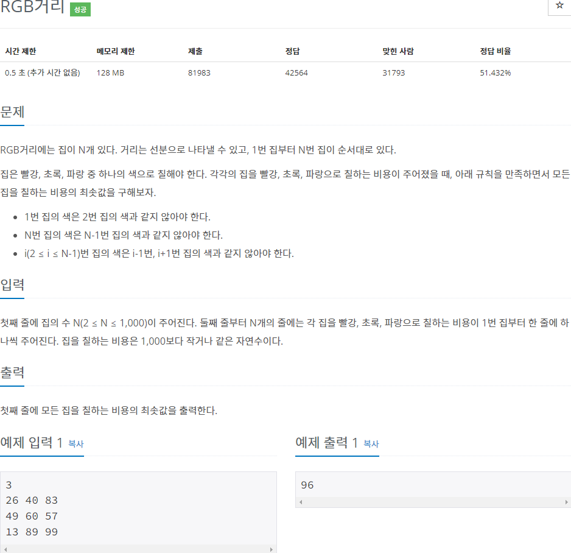

# 20220801_백준1149_RGB거리_송경삼

**1. 문제**

  

**2. 문제에 대한 생각**

예전에 손으로 풀어본적 있었던 문제입니다. 따라서 풀기 전부터 동적 계획법을 이용해 풀어야 한다는 것을 알고 있었지만, 코딩으로 시도해보는 건 처음이었습니다. 


**3. 나의 풀이**

```python
red=[]  
green=[]
blue=[]     #input을 받아 저장할 공간들 입니다.

N=int(input())  #N을 받고
for i in range(N):      #range(N)의 범위에서
    r,g,b=map(int,input().split())
    red.append(r)
    green.append(g)
    blue.append(b)      #input을 색깔별로 나눠서 저장해줍니다.

best_red=[red[0]]
best_green=[green[0]]
best_blue=[blue[0]]     # N번째 집을 이름에 해당하는 색깔로 칠했을때의 최소값을 저장할 공간입니다.

for i in range(1,N):
    best_red.append(min((red[i]+best_blue[i-1]),red[i]+best_green[i-1]))
    best_green.append(min((green[i]+best_red[i-1]),green[i]+best_blue[i-1]))
    best_blue.append(min((blue[i]+best_green[i-1]),blue[i]+best_red[i-1]))

    #i번째 집을 변수 이름의 색깔로 칠할 때는 해당색깔과 다른 i-1번째 집의 정보를 이용합니다.
    #예를 들어 i번째집을 빨간색으로 칠하려면 i-1번째 집을 파란색으로 칠한 최선의 값과 초록으로 칠한 최선의 값 중에
    #더 작은값으로 최선의 방법이 정해집니다.

print(min(best_red[-1],best_green[-1],best_blue[-1]))
#그렇게 채워넣은 정보에서 마지막 값중에 제일 작은 값이 최선의 방법입니다.


```

**4. 다른풀이**

```python
import sys
l = sys.stdin.readlines()
d=[];m=min
for _ in l[1:]:d.append(list(map(int,_.split())))
R,G,B=0,0,0
for i in d:R,G,B=m(G,B)+i[0],m(R,B)+i[1],m(R,G)+i[2]
print(m(R,G,B))
```

백준 아이디 [skygarlics](https://www.acmicpc.net/user/skygarlics)님의 풀이입니다.

보고 새롭게 배운점이 두 가지가 있습니다. m=min을 선언해놓으면 뒤에 min()함수를 m()과같이 줄여 쓸수 있다는점, 표현식과는 약간 다르긴 하지만 for i in R:표현식 과 같이 줄여쓸 수 도 있다는 점이었습니다.

둘다 길이를 짧게할 수 있는 팁이라 알고리즘적인 배움까진 아니어도 파이썬의 표현방법을 더 배울 수 있는 풀이었습니다.

**5. 느낀점**

우선 쉽게 이해하려고 red,blue,green과 같이 세분화해서 했던 점이 사람이 알아보기엔 좋으나, 코드의 길이가 길어지는 원인이 되었다고 생각합니다. 그런 이유 외에도 가장 알고리즘적으로 아쉬웠던 점은 1차원 배열을 세개쓰는 것보다 2차원 배열을 하나 사용해서 풀었으면 좀 더 기술적이었을 것이라고 생각했습니다. 또한 1차원배열을 인풋받는 배열, 결과를 저장할 배열 총 두번에 나눠 저장했는데, 원래 배열을 갱신하는 식으로 해결했으면 좀 더 메모리를 아낄 수 있지 않았을까 생각했습니다.


\*출처

https://www.acmicpc.net/problem/1149
