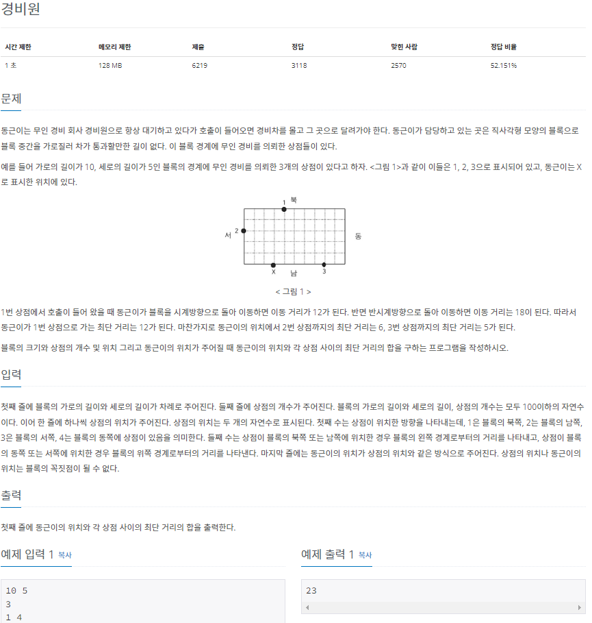

# 20220806_백준2564_경비원_송경삼

**1. 문제**



풀기 복잡한 문제는 아니었습니다. 두 점의 조건이 어떤지에따라 거리를 정하는 것에 초점을 맞추면 쉽게 풀 수 있다고 생각했습니다.


**2. 나의 풀이**

```python
X,Y=map(int, input().split())
N=int(input())
L=[list(map(int,input().split())) for _ in range(N+1)]  #input을 받습니다.

for n,i in enumerate(L):    #받은 input을 순회하면서 다음과 같이 갱신해줍니다.
    if i[0]==1:     #inut이 윗변이라면
        L[n][0]=1   #부호는 +, 거리는 그대로
    elif i[0]==2:   #input이 아랫변이라면
        L[n][0]=-1  #부호는 -, 거리에 Y축을 더해줌
        L[n][1]+=Y
    elif i[0]==3:   #input이 왼변이라면
        L[n][0]=-1  #부호는 -
    else:
        L[n][0]=1   #input이 오른변이라면
        L[n][1]+=X  #부호는 + 거리는 X를 더해줌 

sum=0
for a in L[:-1]:    #갱신한 L을 마지막항 빼고 순회하면서
    sum+=min(abs(a[1]*a[0]-L[-1][0]*L[-1][1]),2*(X+Y)-abs(a[1]*a[0]-L[-1][0]*L[-1][1]))
print(sum)  
#값*부호를 마지막항의 값*부호에서 뺀 값,
#위 값을 둘레에서 뺀 값 중 작은 값을 sum에 더해줍니다.
```


저 같은 경우는 두 점을 양의 방향, 음의 방향으로 정렬했습니다. 정렬 기준점은 왼쪽 꼭지점이었고 따라서 받은 정보를 for 문을 통해 순회하면서 오른쪽으로 더깝게 있으면 [양의 부호, 기준점에서의 거리] 왼쪽으로 더 가깝게 있으면 [음의 부호, 기준점에서의 거리] 로 나눠서 거리의 값에 부호를 곱해서 빼주면 자동적으로 두 점 사이의 거리가 산출되도록 구현했습니다.


**3. 다른풀이와 비교**

```python
w,h=map(int,input().split());l=w+h+w+h;s=[];c=0
for i in range(int(input())+1):a,b=map(int,input().split());s+=[[0,l-b,h+b,b,l-w-b][a]]
for i in s[:-1]:t=abs(i-s[-1]);c+=min(t,l-t)
print(c)
```


백준 아이디 [skygarlics](https://www.acmicpc.net/user/skygarlics) 님의 풀이입니다.

7년 전에 풀었지만 아직까지도 1등인 풀이입니다.

1등이 64ms고 제가  72ms면 꽤 잘풀었구나! 생각했는데, 순위표를 보니 100등이 넘도록 60대 분들이었습니다. 생각보다 빠르게 풀진 않았습니다.

하지만, 로직 자체는 거의 비슷했습니다. 다른 점이 있다면 저는 왼쪽위를 꼭지점으로 양쪽으로 값을 2차원 배열로 정렬했다면 이 분은 1차원 배열만 쓰면서 한쪽 방향으로 값을 정리했습니다. 생각해보니 양쪽 방향이더라도 굳이 부호의 값을 2차원 배열에 저장하지않고 음의 값으로 1차원 행렬을 썼다면 획기적으로 짧아졌겠구나 깨달았습니다. 그 외에 논리 자체는 비슷했습니다.


**4. 느낀점**

메모리를 줄여보고자 input을 받은 행렬을 갱신한 점은 괜찮았다고 생각합니다. 하지만 이 때문에 새로운 행렬도 2차원 행렬로 만들어야겠구나 생각했었는데 너무 틀에 박힌 생각이었습니다. 리스트 속에있는 리스트를 처음부터 정수로 바꿔서 갱신했으면 더 메모리와 코드 길이와 시간 모두 줄일 수 있었다고 생각합니다.


*출처

https://www.acmicpc.net/problem/2564
