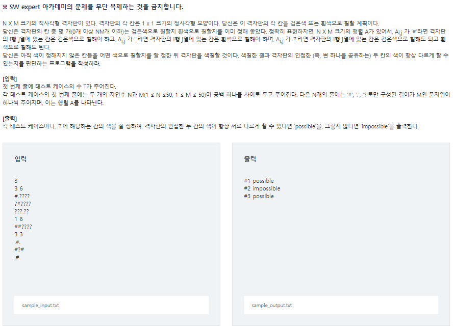

# 20220902_SWEA_14413_격자판칠하기_송경삼

**1. 문제**



C++ 의 걸음마 단계라서 IM단계부터 천천히 시작하려고 안풀어본 IM 문제들을 풀기 시작했습니다. 파이썬으로 한다면 굉장히 간단하게 풀 수 있는 문제 였습니다. 하지만 C++은 할당부터 동적으로 할지 정적으로 할지 정해야했습니다.


**2. 나의 풀이**

```cpp
#include <iostream>

int main() {
	std::ios::sync_with_stdio(0);
	std::cin.tie(0);
	char pos[9] = "possible";
	char imp[11] = "impossible";

	int T;
	std::cin >> T;
	for (int t = 1; t <= T; t++) {
		char L[51][51];
		int N, M;
		std::cin >> N >> M;
		for (int i = 0; i < N; i++) {
			char sub[51];
			std::cin >> sub;
			for (int j = 0; j < M; j++) {
				L[i][j] = sub[j];

			}
		}
		int can1 = 1, can2 = 1;

		for (int i = 0; i < N; i++) {
			for (int j = 0; j < M; j++) {
				int s = (i + j) % 2;
				if (s and L[i][j] != '.') {
					continue;
				}
				else if (s == 0 and L[i][j] != '#') {
					continue;
				}
				else { can1 = 0; break; }

			}
			if (can1 == 0) break;
		}
		for (int i = 0; i < N; i++) {
			for (int j = 0; j < M; j++) {
				int s = (i + j) % 2;
				if (s and L[i][j] != '#') {
					continue;
				}
				else if (s == 0 and L[i][j] != '.') {
					continue;
				}
				else { can2 = 0; break; }

			}
			if (can2 == 0) break;
		}
		if (can1 or can2) {
			std::cout << "#" << t << " " << pos << "\n";
		}
		else std::cout << "#" << t << " " << imp << "\n";
		
	}
}
```


알고리즘 자체는 간단 하게 구성했습니다.

\# 으로 시작하는 경우, .으로 시작하는 경우 두 가지 중에 한가지만 가능해도 성공할 수 있는 알고리즘으로 구성했습니다.

다만, c++ 프로그래밍이 낯설기에 알고리즘을 구현하는데에 큰 어려움이 있었습니다. 우선, input 값이 1~50으로 굉장히 낮기에 정적으로 구현해도 충분한 문제였으나 제 욕심에 동적으로 구현하고 싶어서 new, delete를 사용했었습니다. testcase에서 다 잘돌아가길래 잘 구현했구나 싶었는데 제출하니 런타임에러로 모든 testcase가 틀렸다고 나왔습니다. 욕심 부리지 않고 정적 할당으로 바꾸니 바로 통과하긴 했습니다. 하지만 아직도 로우레벨 동적 할당에 미련을 버리진 못했습니다.


**3. 다른풀이와 비교**

```cpp
#include <stdio.h>
#include <stdbool.h>
 
int main(void) {
    int cases = 0;
    scanf("%d", &cases);
 
    for (int case_=0; case_<cases; case_++) {
        int row_cnt = 0, column_cnt = 0;
        scanf("%d %d", &row_cnt, &column_cnt);
         
        // The point is that if you can make it checkerboard style
        // Let's check if it's consistent when (row + column) is even or odd.
        int sharp_is_odd = -1; // -1: undecided
        int row = 0, column = 0; // scan once across multiple loops
 
        // find first non-'?' character
        for (; row < row_cnt; row++) {
            for (; column < column_cnt; column++) {
                char input = 0;
                scanf(" %c", &input);
 
                if (input == '?') continue;
 
                if (input == '#')
                    sharp_is_odd = (row + column) % 2;
                else // input == '.' - assuming no other characters in the input
                    sharp_is_odd = !((row + column) % 2);
                break;
            }
            if (sharp_is_odd != -1)
                break;
            column = 0; // don't forget!
        }
 
        bool outlier_found = false;
        column++; // next scanf will consume a new character
        for (; row < row_cnt; row++) {
            for (; column < column_cnt; column++) {
                char input = 0;
                scanf(" %c", &input);
 
                if (input == '?') continue;
 
                bool currently_sharp = (input == '#');
 
                bool currently_even = !((row + column) % 2);
 
                bool currently_sharp_is_odd = currently_sharp ^ currently_even;
 
                outlier_found = currently_sharp_is_odd != sharp_is_odd;
 
                if (outlier_found) break;
            }
            if (outlier_found) break;
            column = 0; // don't forget!
        }
 
        // consume the rest
        column++; // next scanf will consume a new character
        for (; row < row_cnt; row++) {
            for (; column < column_cnt; column++) {
                scanf(" %*c");
            }
            column = 0; // don't forget!
        }
 
        printf("#%d %s\n", case_+1, (outlier_found ? "impossible" : "possible"));
    }
}

```


저는 정답이 될 수 있는 2가지 케이스를 인풋에 상관없이 체크했다면, 이 분은 체크할 케이스를 고르기 위해 맨 처음 나오는 # 이나 .의 i+j 값을 추출해서 한가지의 정답만 체크했습니다. C언어로 풀어서 정확한 비교는 불가능하지만, 로우레벨의 구현기술을 배우기 위해 선택해봤습니다. 한가지 눈에 띄는 점은 for문 안에서 여러번 반복되는 i,j 와 같은 값은 처음 선언해놓고 여러 for문에 걸쳐서 써도 된다는 점이었습니다.


**4. 개선 및 후기**

동적할당에서 정적할당으로 급히 바꾸면서 의미없어보이는 

```cpp
char L[51][51];
		int N, M;
		std::cin >> N >> M;
		for (int i = 0; i < N; i++) {
			char sub[51];
			std::cin >> sub;
			for (int j = 0; j < M; j++) {
				L[i][j] = sub[j];
```


```cpp
char L[51][51];
		int N, M;
		std::cin >> N >> M;
		for (int i = 0; i < N; i++) {
			std::cin >> L[i];
```


*출처

https://swexpertacademy.com/main/code/problem/problemDetail.do?contestProbId=AYEXgKnKKg0DFARx


